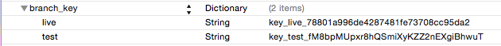

# Branch Metrics iOS SDK Reference

This is a repository of our open source iOS SDK, and the information presented here serves as a reference manual for our iOS SDK. See the table of contents below for a complete list of the content featured in this document.

**Note:** Go to our new [**Documentation Portal**](https://dev.branch.io) where you can find all of our latest documentation and future documentation updates.

Table of Contents|
------------- |
[Get the Demo App](#get-the-demo-app)|
[Class Reference Table](#class-reference)|
[Important Migrations](#important-migration-to-v090)      |
[Troubleshooting FAQ](#faq) 		  |
[Installation](#installation)|
[Configuration (for Tracking)](#configuration-for-tracking)|
[Register a URI Scheme Direct Deep Linking (Optional, but Recommended)](#register-a-uri-scheme-direct-deep-linking-optional-but-recommended)|
[Add Your Branch Key to Your Project](#add-your-branch-key-to-your-project)|

## Get the Demo App

There's a full demo app embedded in this repository, but you can also check out our live demo: [Branch Monster Factory](https://itunes.apple.com/us/app/id917737838). We've [open sourced the Branchster's app](https://github.com/BranchMetrics/Branchster-iOS) as well if you're ready to dig in.


## Class Reference
For your reference, see the methods and parameters table below.

** Class Reference Table **

| Tasks          | Methods          | Parameters     |
|:------------- |:---------------:| -------------:|
[Get a Singleton Branch Instance](#get-a-singleton-branch-instance)|[Method](#methods)|[Parameter](#parameters)
|[Init Branch Session and Deep Link Routing Function](#init-branch-session-and-deep-link-routing-function)|[Method](#methods-1)|[Parameter](#parameters-1)|
|[Register Deep Link Controller](#register-a-deep-link-controller)|[Method](#methods-2)|[Parameter](#parameters-2)|
|[Retrieve Session (Install or Open) Parameters](#retrieve-session-install-or-open-parameters)|[Method](#methods-3)|[Parameter](#parameters-3)|
|[Retrieve Install (Install Only) Parameters](#retrieve-install-install-only-parameters)|[Method](#methods-4)|[Parameter](#parameters-4)|
[Persistent Identities](#persistent-identities)|[Method](#methods-5)|[Parameter](#parameters-5)|
[Logout](#logout)|[Method](#methods-6)|[Parameter](#parameters-6)|
[Register Custom Events](#register-custom-events)|[Method](#methods-7)| [Parameter](#parameters-7)|
[Generate Tracked, Deep Linking URLs (Pass Data Across Install and Open)](#generate-tracked-deep-linking-urls-pass-data-across-install-and-open)|[Method](#methods-8)|[Parameter](#parameters-8)|
[UIActivityView Share Sheet](#uiactivityview-share-sheet)|[Method](#methods-9)|[Parameter](#parameters-9)|
|[Get Reward Balance](#get-reward-balance)|[Method](#methods-10)|[Parameters](#parameters-10)|
[Redeem All or Some of the Reward Balance (Store State)](#redeem-all-or-some-of-the-reward-balance-store-state)|[Method](#methods-11)|[Parameter](#parameters-11)|
[Get Credit History](#get-credit-history)|[Method](#methods-12)|[Parameters](#parameters-12)|
[Get Promo Code](#get-promo-code)|[Method](#methods-13)|[Parameter](#parameters-13)|
[Create Promo Code](#create-promo-code)|[Method](#methods-14)|[Parameter](#parameters-14)|
[Validate Promo Code](#validate-promo-code)|[Method](#methods-18)|[Parameter](#parameters-18)|
[Apply Promo Code](#apply-promo-code)|[Method](#methods-19)|[Parameter](#parameters-19)|

## Important Migration to v0.9.0
We are renaming Referral Codes to Promo Codes to better indicate their purpose. Promo Codes do *not* establish a referred/referring user install relationship, which is unclear when called "referral codes." Consequently, all of the ReferralCode methods have been deprecated in favor of their PromoCode counterparts.

Additionally the enums around these items have been renamed to better represent their meaning. You may need to rename your usages to account for this.

Lastly, when migrating to the PromoCode methods, note that the response dictionary will now contain `promo_code` instead of `referral_code`.

Note that all of these changes are temporarily backwards compatible (with the exception of the enum rename). Compatability will be removed with the eventual 1.0.0 release.

## Important Migration to v0.7.8
The `source:iOS` attribute has been removed from the params dictionary for links. However, a bunch of constants have been added that are added by the Branch backend to link clicks and opens. If you were relying on the source attribute in the past, you can now find that via the `BRANCH_INIT_KEY_CREATION_SOURCE`.

## Important Migration to v0.6.0

We have deprecated the bnc\_appkey and replaced that with the new branch_key. Please see [add branch key](#add-your-branch-key-to-your-project) for details.


## FAQ

Have questions? Need troubleshooting assistance? See our [FAQs]  (https://dev.branch.io/references/ios_sdk/#faq) for in depth answers.

## Installation

The compiled SDK size is ~155kb. You can clone this repository to keep up with the latest version, you can install via CocoaPods, or you can download the raw files.

### Available in CocoaPods

Branch is available through [CocoaPods](http://cocoapods.org). To install it, simply add the following line to your Podfile:

```objc
pod "Branch"
```

### Download the Raw Files

You can also install by downloading the raw files below.

* Download code from here:
[https://s3-us-west-1.amazonaws.com/branchhost/Branch-iOS-SDK.zip](https://s3-us-west-1.amazonaws.com/branchhost/Branch-iOS-SDK.zip)

* The testbed project:
[https://s3-us-west-1.amazonaws.com/branchhost/Branch-iOS-TestBed.zip](https://s3-us-west-1.amazonaws.com/branchhost/Branch-iOS-TestBed.zip)


### Register Your App

You can sign up for your own app id at [https://dashboard.branch.io](https://dashboard.branch.io).

## Configuration (for Tracking)

For help configuring the SDK, see the [iOS Quickstart Guide](https://github.com/BranchMetrics/Branch-Integration-Guides/blob/master/ios-quickstart.md).

**Note**: Our linking infrastructure will support anything you want to build. If it doesn't, we'll fix it so that it does. Just reach out to alex@branch.io with requests.

### Register a URI Scheme Direct Deep Linking (Optional but Recommended)

You can register your app to respond to direct deep links (yourapp:// in a mobile browser) by adding a URI scheme in the YourProject-Info.plist file. Make sure to change **yourapp** to a unique string that represents your app name.

1. In Xcode, click on YourProject-Info.plist on the left.
1. Find URL Types and click the right arrow. (If it doesn't exist, right click anywhere and choose Add Row. Scroll down and choose URL Types).
1. Add "yourapp," where yourapp is a unique string for your app, as an item in URL Schemes as below:


Alternatively, you can add the URI scheme in your project's Info page.

1. In Xcode, click your project in the Navigator (on the left side).
1. Select the "Info" tab.
1. Expand the "URL Types" section at the bottom.
1. Click the "+" sign to add a new URI Scheme, as below:


### Add Your Branch Key to Your Project

After you register your app, your Branch Key can be retrieved on the [Settings](https://dashboard.branch.io/#/settings) page of the dashboard. Now you need to add it to YourProject-Info.plist (Info.plist for Swift).

1. In plist file, mouse hover "Information Property List," which is the root item under the Key column.
1. After about half a second, you will see a "+" sign appear. Click it.
1. In the newly added row, fill in "branch_key" for its key, leave type as String, and enter your app's Branch Key obtained in above steps in the value column.
1. Save the plist file.


If you want to add a key for both your live and test apps at the same time, you need change the type column to Dictionary, and add two entries inside:
1. For live app, use "live" (without double quotes) for key, String for type, and your live branch key for value.
2. For test app, use "test" (without double quotes) for key, String for type, and your test branch key for value.



#### URI Scheme Considerations

The Branch SDK will pull the first URI Scheme from your list that is not one of `fb`, `db`, or `pin`. This value will be used one time to set the iOS URI Scheme under your Link Settings in the Branch Dashboard.

For additional help configuring the SDK, including step-by-step instructions, please see the [iOS Quickstart Guide](https://github.com/BranchMetrics/Branch-Integration-Guides/blob/master/ios-quickstart.md).

### Get a Singleton Branch Instance

All Branch methods require an instance of the main Branch object. Here's how you can get one. It's stored statically and is accessible from any class.

#### Methods

###### Objective-C
```objc
Branch *branch = [Branch getInstance];
```

###### Swift
```swift
let branch: Branch = Branch.getInstance()
```

###### Objective-C
```objc
#warning Remove for launch
Branch *branch = [Branch getTestInstance];
```

###### Swift
```swift
//TODO: Remove for launch
let branch: Branch = Branch.getTestInstance();
```

#### Parameters

**Branch key** (NSString *) _optional_
: If you don't store the Branch key in the plist file, you have the option of passing this key as an argument.


### Init Branch Session and Deep Link Routing Function

To deep link, Branch must initialize a session to check if the user originated from a link. This call will initialize a new session _every time the app opens_. 100% of the time the app opens, it will call the deep link handling block to inform you whether the user came from a link. If your app opens with keys in the params, you'll want to route the user depending on the data you passed in. Otherwise, send them to a generic screen.

#### Methods

###### Objective-C
```objc
- (BOOL)application:(UIApplication *)application didFinishLaunchingWithOptions:(NSDictionary *)launchOptions {
    Branch *branch = [Branch getInstance];
    [branch initSessionWithLaunchOptions:launchOptions isReferrable:YES andRegisterDeepLinkHandler:^(NSDictionary *params, NSError *error) {
    	// route the user based on what's in params
    }];
    return YES;
}

- (BOOL)application:(UIApplication *)application openURL:(NSURL *)url sourceApplication:(NSString *)sourceApplication annotation:(id)annotation {
    if (![[Branch getInstance] handleDeepLink:url]) {
        // do other deep link routing for the Facebook SDK, Pinterest SDK, etc
    }
    return YES;
}
```

###### Swift
```swift
func application(application: UIApplication, didFinishLaunchingWithOptions launchOptions: [NSObject: AnyObject]?) -> Bool {
    let branch: Branch = Branch.getInstance()
    branch.initSessionWithLaunchOptions(launchOptions, true, andRegisterDeepLinkHandler: { params, error in
    	// route the user based on what's in params
    })
    return true
}

func application(application: UIApplication, openURL url: NSURL, sourceApplication: String?, annotation: AnyObject?) -> Bool {
    if (!Branch.getInstance().handleDeepLink(url)) {
        // do other deep link routing for the Facebook SDK, Pinterest SDK, etc
    }

    return true
}
```

#### Parameters

###### initSession

**launchOptions** (NSDictionary *) _required_
: These launch options are passed to Branch through didFinishLaunchingWithOptions and will notify us if the user originated from a URI call or not. If the app was opened from a URI like myapp://, we need to follow a special initialization routine.

**deepLinkHandler** ^(NSDictionary *params, NSError *error) _optional_
: This is the callback block that Branch will execute after a network call to determine where the user comes from. It is called 100% of the time the app opens up since Branch registers for lifecycle notifications.

- _NSDictionary *params_ : These params will contain any data associated with the Branch link that was clicked before the app session began. There are a few keys which are always present:
	- '+is_first_session' Denotes whether this is the first session (install) or any other session (open)
	- '+clicked_branch_link' Denotes whether or not the user clicked a Branch link that triggered this session
- _NSError *error_ : This error will be nil unless there is an error such as connectivity or otherwise. Check !error to confirm it was a valid link.
    - BNCServerProblemError There was an issue connecting to the Branch service
    - BNCBadRequestError The request was improperly formatted

**isReferrable** (BOOL) _optional_
: This boolean lets you control whether or not the user is eligible to be 'referred'. This is applicable for credits and influencer tracking. If isReferrable is set to NO | false, and the user clicks a link before entering the app, deep link parameters will appear, but that user will _not_ be considered referred. If isReferrable is set to YES | true, and the user clicks a link, deep link params will appear and the user _will_ be considered referred. Remove this argument to access the default, which only allows the user to be referred on a _fresh install_, but not on opens.

**automaticallyDisplayDeepLinkController** (BOOL) _optional_
: This boolean lets you control whether or not the Branch should attempt to launch Deep Linked controllers (based on those registered with `[branch registerDeepLinkController:forKey:]`). The default is NO | false.

###### handleDeepLink

**url** (NSString *) _required_
: This argument passes us the URI string so that we can parse the extra parameters. For example, 'myapp://open?link_click_id=12345'.

#### Returns

###### initSession

Nothing

###### handleDeepLink

**BOOL** handleDeepLink will return a boolean indicating whether Branch has handled the URI. If the URI call is 'myapp://open?link_click_id=12345', then handleDeepLink will return YES because the Branch click object is present. If just 'myapp://', handleDeepLink will return NO.

###Register a Deep Link Controller

Register a controller for Branch to show when specific keys are present in the Branch open / install dictionary.

#### Methods

###### Objective-C

```objc
[[Branch getInstance] registerDeepLinkController:myController forKey:@"my-key"];
```

###### Swift

```swift
Branch.getInstance().registerDeepLinkController(myController forKey:"my-key")
```

#### Parameters

**controller** (UIViewController <BranchDeepLinkingController> *) _required_
: The controller to display when the key is present in the dictionary.

**key** (NSString *) _required_
: The key checked for in open / install dictionaries.

#### Returns

Nothing

###Retrieve session (install or open) parameters

These session parameters will be available at any point later on with this command. If no params, the dictionary will be empty. This refreshes with every new session (app installs AND app opens).

#### Methods

###### Objective-C

```objc
NSDictionary *sessionParams = [[Branch getInstance] getLatestReferringParams];
```

###### Swift

```swift
let sessionParams = Branch.getInstance().getLatestReferringParams()
```

#### Parameters

None

#### Returns

**NSDictionary *** When initSession returns a parameter set in the deep link callback, we store it in NSUserDefaults for the duration of the session in case you want to retrieve it later. Careful, once the app is minimized and the session ends, this will be cleared.

### Retrieve Install (Install Only) Parameters

If you ever want to access the original session params (the parameters passed in for the first install event only), you can use this line. This is useful if you only want to reward users who newly installed the app from a referral link. Note that these parameters can be updated when `setIdentity:` is called and identity merging occurs.

#### Methods

###### Objective-C

```objc
NSDictionary *installParams = [[Branch getInstance] getFirstReferringParams]; // previously getInstallReferringParams
```

###### Swift

```swift
let installParams = Branch.getInstance().getFirstReferringParams() // previously getInstallReferringParams
```

#### Parameters

None

### Persistent Identities

Often, you might have your own user IDs, or want referral and event data to persist across platforms or uninstall/reinstall. It's helpful if you know your users access your service from different devices. This where we introduce the concept of an 'identity'.

#### Methods

To identify a user, just call:


###### Objective-C

```objc
// previously identifyUser:
[[Branch getInstance] setIdentity:your user id];    // your user id should not exceed 127 characters
```

###### Swift

```swift
// previously identifyUser:
Branch.getInstance().setIdentity(your user id)  // your user id should not exceed 127 characters
```

#### Parameters
None

### Logout

If you provide a logout function in your app, be sure to clear the user when the logout completes. This will ensure that all the stored parameters get cleared and all events are properly attributed to the right identity.

**Warning**: This call will clear the promo credits and attribution on the device.

#### Methods

###### Objective-C

```objc
[[Branch getInstance] logout];  // previously clearUser
```

###### Swift

```swift
Branch.getInstance().logout()   // previously clearUser
```

#### Parameters
None

### Register Custom Events

#### Methods

###### Objective-C

```objc
[[Branch getInstance] userCompletedAction:@"your_custom_event"]; // your custom event name should not exceed 63 characters
```

###### Swift

```swift
Branch.getInstance().userCompletedAction("your_custom_event") // your custom event name should not exceed 63 characters
```

OR if you want to store some state with the event:

###### Objective-C

```objc
[[Branch getInstance] userCompletedAction:@"your_custom_event" withState:(NSDictionary *)appState]; // same 63 characters max limit
```

###### Swift

```swift
Branch.getInstance().userCompletedAction("your_custom_action", withState: [String: String]()) // same 63 characters max limit; replace [String: String]() with params dictionary
```

Some example events you might want to track:

```objc
@"complete_purchase"
@"wrote_message"
@"finished_level_ten"
```

####Parameters
None

## Generate Tracked, Deep Linking URLs (Pass Data Across Install and Open)

### Shortened Links

There are a bunch of options for creating these links. You can tag them for analytics in the dashboard, or you can even pass data to the new installs or opens that come from the link click. How awesome is that? You need to pass a callback for when you link is prepared (which should return very quickly, ~ 50 ms to process).

#### Encoding Note
One quick note about encoding. Since `NSJSONSerialization` supports a limited set of classes, we do some custom encoding to allow additional types. Current supported types include `NSDictionary`, `NSArray`, `NSURL`, `NSString`, `NSNumber`, `NSNull`, and `NSDate` (encoded as an ISO8601 string with timezone). If a parameter is of an unknown type, it will be ignored.


For more details on how to create links, see the [Branch link creation guide](https://github.com/BranchMetrics/Branch-Integration-Guides/blob/master/url-creation-guide.md)

#### Methods

###### Objective-C

```objc
// associate data with a link
// you can access this data from any instance that installs or opens the app from this link (amazing...)

NSMutableDictionary *params = [[NSMutableDictionary alloc] init];

[params setObject:@"Joe" forKey:@"user"];
[params setObject:@"https://s3-us-west-1.amazonaws.com/myapp/joes_pic.jpg" forKey:@"profile_pic"];
[params setObject:@"Joe likes long walks on the beach..." forKey:@"description"];

// Customize the display of the link
[params setObject:@"Joe's My App Referral" forKey:@"$og_title"];
[params setObject:@"https://s3-us-west-1.amazonaws.com/myapp/joes_pic.jpg" forKey:@"$og_image_url"];
[params setObject:@"Join Joe in My App - it's awesome" forKey:@"$og_description"];

// Customize the redirect performance
[params setObject:@"http://myapp.com/desktop_splash" forKey:@"$desktop_url"];

// associate a url with a set of tags, channel, feature, and stage for better analytics.
// tags: nil or example set of tags could be "version1", "trial6", etc; each tag should not exceed 64 characters
// channel: nil or examples: "facebook", "twitter", "text_message", etc; should not exceed 128 characters
// feature: nil or examples: FEATURE_TAG_SHARE, FEATURE_TAG_REFERRAL, "unlock", etc; should not exceed 128 characters
// stage: nil or examples: "past_customer", "logged_in", "level_6"; should not exceed 128 characters

// Link 'type' can be used for scenarios where you want the link to only deep link the first time.
// Use nil, BranchLinkTypeUnlimitedUse or BranchLinkTypeOneTimeUse

// Link 'alias' can be used to label the endpoint on the link. For example: http://bnc.lt/AUSTIN28. Should not exceed 128 characters
// Be careful about aliases: these are immutable objects permanently associated with the data and associated paramters you pass into the link. When you create one in the SDK, it's tied to that user identity as well (automatically specified by the Branch internals). If you want to retrieve the same link again, you'll need to call getShortUrl with all of the same parameters from before.

Branch *branch = [Branch getInstance];
[branch getShortURLWithParams:params andTags:@[@"version1", @"trial6"] andChannel:@"text_message" andFeature:BRANCH_FEATURE_TAG_SHARE andStage:@"level_6" andCallback:^(NSString *url, NSError *error) {
    // show the link to the user or share it immediately
}];

// The callback will return null if the link generation fails (or if the alias specified is aleady taken.)
```

###### Swift

```swift
// associate data with a link
// you can access this data from any instance that installs or opens the app from this link (amazing...)

var params = ["user": "Joe"]
params["profile_pic"] = "https://s3-us-west-1.amazonaws.com/myapp/joes_pic.jpg"
params["description"] = "Joe likes long walks on the beach..."

// Customize the display of the link
params["$og_title"] = "Joe's My App Referral"
params["$og_image_url"] = "https://s3-us-west-1.amazonaws.com/myapp/joes_pic.jpg"
params["$og_description"] = "Join Joe in My App - it's awesome"

// Customize the redirect performance
params["$desktop_url"] = "http://myapp.com/desktop_splash"

// associate a url with a set of tags, channel, feature, and stage for better analytics.
// tags: nil or example set of tags could be "version1", "trial6", etc; each tag should not exceed 64 characters
// channel: nil or examples: "facebook", "twitter", "text_message", etc; should not exceed 128 characters
// feature: nil or examples: FEATURE_TAG_SHARE, FEATURE_TAG_REFERRAL, "unlock", etc; should not exceed 128 characters
// stage: nil or examples: "past_customer", "logged_in", "level_6"; should not exceed 128 characters

// Link 'type' can be used for scenarios where you want the link to only deep link the first time.
// Use nil, BranchLinkTypeUnlimitedUse or BranchLinkTypeOneTimeUse

// Link 'alias' can be used to label the endpoint on the link. For example: http://bnc.lt/AUSTIN28. Should not exceed 128 characters
// Be careful about aliases: these are immutable objects permanently associated with the data and associated paramters you pass into the link. When you create one in the SDK, it's tied to that user identity as well (automatically specified by the Branch internals). If you want to retrieve the same link again, you'll need to call getShortUrl with all of the same parameters from before.

// The callback will return null if the link generation fails (or if the alias specified is aleady taken.)

Branch.getInstance().getShortURLWithParams(params, andTags: ["version1", "trial6"], andChannel: "text_message", andFeature: BRANCH_FEATURE_TAG_SHARE, andStage: "level_6", andCallback: { (url: String!, error: NSError!) -> Void in
    if (error == nil) {
        // show the link to the user or share it immediately
    }
})
```

There are other methods which exclude tag and data if you don't want to pass those. Explore Xcode's autocomplete functionality.

####Parameters
**alias**: The alias for a link.

**callback**: The callback that is called with the promo code object on success, or an error if it’s invalid.

**channel**: The channel for the link. Examples could be Facebook, Twitter, SMS, etc., depending on where it will be shared.

**feature**: The feature the generated link will be associated with.

**params**: A dictionary to use while building up the Branch link.

**stage**: The stage used for the generated link, indicating what part of a funnel the user is in.

**tags**: An array of tag strings to be associated with the link.

**Note**:
You can customize the Facebook OG tags of each URL if you want to dynamically share content by using the following _optional keys in the data dictionary_. Please use this [Facebook tool](https://developers.facebook.com/tools/debug/og/object) to debug your OG tags.

| Key | Value
| --- | ---
| "$og_title" | The title you'd like to appear for the link in social media.
| "$og_description" | The description you'd like to appear for the link in social media.
| "$og_image_url" | The URL for the image you'd like to appear for the link in social media.
| "$og_video" | The URL for the video.
| "$og_url" | The URL you'd like to appear.
| "$og_redirect" | If you want to bypass our OG tags and use your own, use this key with the URL that contains your site's metadata.

You can do custom redirection by inserting the following _optional keys in the dictionary_:

| Key | Value
| --- | ---
| "$desktop_url" | Where to send the user on a desktop or laptop. By default it is the Branch-hosted text-me service.
| "$android_url" | The replacement URL for the Play Store to send the user if they don't have the app. _Only necessary if you want a mobile web splash_.
| "$ios_url" | The replacement URL for the App Store to send the user if they don't have the app. _Only necessary if you want a mobile web splash_.
| "$ipad_url" | Same as above, but for iPad Store.
| "$fire_url" | Same as above, but for Amazon Fire Store.
| "$blackberry_url" | Same as above, but for Blackberry Store.
| "$windows_phone_url" | Same as above, but for Windows Store.
| "$after_click_url" | When a user returns to the browser after going to the app, take them to this URL. _iOS only; Android coming soon_.

You have the ability to control the direct deep linking of each link by inserting the following _optional keys in the dictionary_:

| Key | Value
| --- | ---
| "$deeplink_path" | The value of the deep link path that you'd like us to append to your URI. For example, you could specify "$deeplink_path": "radio/station/456" and we'll open the app with the URI "yourapp://radio/station/456?link_click_id=branch-identifier". This is primarily for supporting legacy deep linking infrastructure.
| "$always_deeplink" | true or false. (default is not to deep link first) This key can be specified to have our linking service force try to open the app, even if we're not sure the user has the app installed. If the app is not installed, we fall back to the respective app store or $platform_url key. By default, we only open the app if we've seen a user initiate a session in your app from a Branch link (has been cookied and deep linked by Branch).

### UIActivityView Share Sheet

UIActivityView is the standard way of allowing users to share content from your app. A common use case is a user sharing a promo code, or a content URL with their friends. If you want to give your users a way of sharing content from your app, this is the simplest way to implement Branch.

**Sample UIActivityView Share Sheet**


The Branch iOS SDK includes a subclassed UIActivityItemProvider that can be passed into a UIActivityViewController, that will generate a Branch short URL and automatically tag it with the channel the user selects (Facebook, Twitter, etc.).

You can optionally provide a delegate that conforms to the `BranchActivityItemProviderDelegate` which allows you to customize the content of the short url actually used to shared depending on which platform the user has chosen to share with.

As [mentioned in the docs](https://dev.branch.io/recipes/dynamic_link_creation/#parameters-1), you can customize generated links to provide an `$og_image_url` if the user is posting to Facebook, or `twitter:image` if the user chose Twitter, for example.

The sample app included with the Branch iOS SDK shows a sample of this in ViewController.m:

#### Methods

###### Objective-C

```objc
// Setup up the content you want to share, and the Branch
// params and properties, as you would for any branch link

// No need to set the channel, that is done automatically based
// on the share activity the user selects
NSString *shareString = @"Super amazing thing I want to share!";
UIImage *amazingImage = [UIImage imageNamed:@"Super-Amazing-Image.png"];

NSMutableDictionary *params = [[NSMutableDictionary alloc] init];

[params setObject:@"Joe" forKey:@"user"];
[params setObject:@"https://s3-us-west-1.amazonaws.com/myapp/joes_pic.jpg" forKey:@"profile_pic"];
[params setObject:@"Joe likes long walks on the beach..." forKey:@"description"];

// Customize the display of the link
[params setObject:@"Joe's My App Referral" forKey:@"$og_title"];
[params setObject:@"https://s3-us-west-1.amazonaws.com/myapp/joes_pic.jpg" forKey:@"$og_image_url"];
[params setObject:@"Join Joe in My App - it's awesome" forKey:@"$og_description"];

// Customize the redirect performance
[params setObject:@"http://myapp.com/desktop_splash" forKey:@"$desktop_url"];

NSArray *tags = @[@"tag1", @"tag2"];
NSString *feature = @"invite";
NSString *stage = @"2";

// Branch UIActivityItemProvider
UIActivityItemProvider *itemProvider = [Branch getBranchActivityItemWithParams:params andFeature:feature andStage:stage andTags:tags];

// Pass this in the NSArray of ActivityItems when initializing a UIActivityViewController
UIActivityViewController *shareViewController = [[UIActivityViewController alloc] initWithActivityItems:@[shareString, amazingImage, itemProvider] applicationActivities:nil];

// Present the share sheet!
[self.navigationController presentViewController:shareViewController animated:YES completion:nil];
```

###### Swift

```swift
// Setup up the content you want to share, and the Branch
// params and properties, as you would for any branch link

// No need to set the channel, that is done automatically based
// on the share activity the user selects
var items: Array = [AnyObject]()

let shareString = "Super amazing thing I want to share!"
items.append(shareString)
if let amazingImage: UIImage = UIImage(named: "mada.png") {
    items.append(amazingImage)
}

var params = ["user": "Joe"]
params["profile_pic"] = "https://s3-us-west-1.amazonaws.com/myapp/joes_pic.jpg"
params["description"] = "Joe likes long walks on the beach..."

// Customize the display of the link
params["$og_title"] = "Joe's My App Referral"
params["$og_image_url"] = "https://s3-us-west-1.amazonaws.com/myapp/joes_pic.jpg"
params["$og_description"] = "Join Joe in My App - it's awesome"

// Customize the redirect performance
params["$desktop_url"] = "http://myapp.com/desktop_splash"

let tags = ["tag1", "tag2"]
let feature = "invite"
let stage = "2"

// Branch UIActivityItemProvider
let itemProvider = Branch.getBranchActivityItemWithParams(params, feature: feature, stage: stage, tags: tags)
items.append(itemProvider)

// Pass this in the NSArray of ActivityItems when initializing a UIActivityViewController
let shareViewController = UIActivityViewController(activityItems: items, applicationActivities: nil)

// Present the share sheet!
self.navigationController?.presentViewController(shareViewController, animated: true, completion: nil)
```
####Parameters

**feature**: The feature the generated link will be associated with.

**params**: A dictionary to use while building up the Branch link.

**stage**: The stage used for the generated link, indicating what part of a funnel the user is in.

**tags**: An array of tag strings to be associated with the link.

## Referral System Rewarding Functionality

In a standard referral system, you have two parties: the original user and the invitee. Our system is flexible enough to handle rewards for all users for any actions. Here are a some example scenarios:

* Reward the original user for taking action (e.g. inviting, purchasing, etc.).

* Reward the invitee for installing the app from the original user's referral link.

* Reward the original user when the invitee takes action (e.g. give the original user credit when their invitee buys something).

These reward definitions are created on the dashboard, under the 'Reward Rules' section in the 'Referrals' tab on the dashboard. For more information, see the [Rewards] (https://dev.branch.io/recipes/referral_links_with_incentives/#rewards) section in the [documentation portal](https://dev.branch.io/recipes/referral_links_with_incentives/#rewards).

**Warning**: For a promo program, you should not use unique awards for custom events and redeem pre-identify call. This can allow users to cheat the system.

### Get Reward Balance

Reward balances change randomly on the backend when certain actions are taken (defined by your rules), so you'll need to make an asynchronous call to retrieve the balance. Here is the syntax:

####Methods

###### Objective-C

```objc
[[Branch getInstance] loadRewardsWithCallback:^(BOOL changed, NSError *error) {
    // changed boolean will indicate if the balance changed from what is currently in memory

    // will return the balance of the current user's credits
    NSInteger credits = [[Branch getInstance] getCredits];
}];
```

###### Swift

```swift
Branch.getInstance().loadRewardsWithCallback { (changed: Bool, error: NSError!) -> Void in
    // changed boolean will indicate if the balance changed from what is currently in memory

    // will return the balance of the current user's credits
    let credits = Branch().getCredits()
}
```

#### Parameters

**callback**: The callback that is called once the request has completed.

### Redeem All or Some of the Reward Balance (Store State)

Redeeming credits allows users to cash in the credits they've earned. Upon successful redemption, the user's balance will be updated reflecting the deduction.

#### Methods

###### Objective-C

```objc
// Save that the user has redeemed 5 credits
[[Branch getInstance] redeemRewards:5];
```

###### Swift

```swift
// Save that the user has redeemed 5 credits
Branch.getInstance().redeemRewards(5)
```

#### Parameters
**amount**: The number of credits being redeemed.

### Get Credit History

This call will retrieve the entire history of credits and redemptions from the individual user. To use this call, implement like so:

#### Methods

###### Objective-C

```objc
[[Branch getInstance] getCreditHistoryWithCallback:^(NSArray *history, NSError *error) {
    if (!error) {
        // process history
    }
}];
```

###### Swift

```swift
Branch.getInstance().getCreditHistoryWithCallback { (history: [AnyObject]!, error: NSError!) -> Void in
    if (error == nil) {
        // process history
    }
}
```

The response will return an array that has been parsed from the following JSON:

```json
[
    {
        "transaction": {
                           "date": "2014-10-14T01:54:40.425Z",
                           "id": "50388077461373184",
                           "bucket": "default",
                           "type": 0,
                           "amount": 5
                       },
        "event" : {
            "name": "event name",
            "metadata": { your event metadata if present }
        },
        "referrer": "12345678",
        "referree": null
    },
    {
        "transaction": {
                           "date": "2014-10-14T01:55:09.474Z",
                           "id": "50388199301710081",
                           "bucket": "default",
                           "type": 2,
                           "amount": -3
                       },
        "event" : {
            "name": "event name",
            "metadata": { your event metadata if present }
        },
        "referrer": null,
        "referree": "12345678"
    }
]
```
#### Parameters

**referrer**
: The id of the referring user for this credit transaction. Returns null if no referrer is involved. Note this id is the user id in a developer's own system that's previously passed to Branch's identify user API call.

**referree**
: The id of the user who was referred for this credit transaction. Returns null if no referree is involved. Note this id is the user id in a developer's own system that's previously passed to Branch's identify user API call.

**type**
: This is the type of credit transaction.

1. _0_ - A reward that was added automatically by the user completing an action or promo.
1. _1_ - A reward that was added manually.
2. _2_ - A redemption of credits that occurred through our API or SDKs.
3. _3_ - This is a very unique case where we will subtract credits automatically when we detect fraud.

### Get Promo Code

Retrieve the promo code created by current user.

####Methods

###### Objective-C

```objc
[[Branch getInstance] getPromoCodeWithCallback:^(NSDictionary *params, NSError *error) {
    if (!error) {
        NSString *promoCode = [params objectForKey:@"promo_code"];
    }
}];
```

###### Swift

```swift
Branch.getInstance().getPromoCodeWithCallback { (params: [NSObject : AnyObject]!, error: NSError!) -> Void in
    if (error == nil) {
        let promoCode: AnyObject? = params["promo_code"]
    }
}
```

#### Parameters
**callback**: The callback that is called with the created promo code object.


### Create Promo Code

Create a new promo code for the current user, only if this user doesn't have any existing non-expired promo code.

In the simplest form, just specify an amount for the promo code.
The returned promo code is a six character long unique alpha-numeric string wrapped inside the params dictionary with key @"promo_code".


#### Methods

###### Objective-C

```objc
// Create a promo code of 5 credits
[[Branch getInstance] getPromoCodeWithAmount:5
                                    callback:^(NSDictionary *params, NSError *error) {
                                        if (!error) {
                                            NSString *promoCode = [params objectForKey:@"promo_code"];
                                            // do whatever with promoCode
                                        }
                                    }
];
```

###### Swift

```swift
// Create a promo code of 5 credits
Branch.getInstance().getPromoCodeWithAmount(5, callback: { (params: [NSObject : AnyObject]!, error: NSError!) -> Void in
    if (error == nil) {
        let promoCode: AnyObject? = params["promo_code"]
        // do whatever with promoCode
    }
})
```

#### Parameters

**amount** _NSInteger_: The amount of credit to redeem when a user applies the promo code.

Alternatively, you can specify a prefix for the promo code.
The resulting code will have your prefix, concatenated with a two character long unique alpha-numeric string wrapped in the same data structure.


#### Methods

###### Objective-C

```objc
// Create a promo code with prefix "BRANCH", 5 credits, and without an expiration date
[[Branch getInstance] getPromoCodeWithPrefix:@"BRANCH"   // prefix should not exceed 48 characters
                                      amount:5
                                    callback:^(NSDictionary *params, NSError *error) {
                                        if (!error) {
                                            NSString *promoCode = [params objectForKey:@"promo_code"];
                                            // do whatever with promoCode
                                        }
                                    }
];
```

###### Swift

```swift
// Create a promo code with prefix "BRANCH", 5 credits, and without an expiration date
// prefix should not exceed 48 characters
Branch.getInstance().getPromoCodeWithPrefix("BRANCH", amount: 5, callback: { (params: [NSObject : AnyObject]!, error: NSError!) -> Void in
    if (error == nil) {
        let promoCode: AnyObject? = params["promo_code"]
        // do whatever with promoCode
    }
})
```

#### Parameters

**prefix** _NSString*_
: The prefix to the promo code that you desire.

If you want to specify an expiration date for the promo code, you can add an "expiration:" parameter.
The prefix parameter is optional here, i.e. it could be getPromoCodeWithAmount:expiration:andCallback.

####Methods

###### Objective-C

```objc
[[Branch getInstance] getPromoCodeWithPrefix:@"BRANCH"   // prefix should not exceed 48 characters
                                      amount:5
                                  expiration:[[NSDate date] dateByAddingTimeInterval:60 * 60 * 24]
                                    callback:^(NSDictionary *params, NSError *error) {
                                        if (!error) {
                                            NSString *promoCode = [params objectForKey:@"promo_code"];
                                            // do whatever with promoCode
                                        }
                                    }
];
```

###### Swift

```swift
// prefix should not exceed 48 characters
Branch.getInstance().getPromoCodeWithPrefix("BRANCH", amount: 5, expiration: NSDate().dateByAddingTimeInterval(60*60*24), callback: { (params: [NSObject : AnyObject]!, error: NSError!) -> Void in
    if (error == nil) {
        let promoCode: AnyObject? = params["promo_code"]
        // do whatever with promoCode
    }
})
```

#### Parameters

**expiration** _NSDate*_
: The expiration date of the promo code.

#### Methods

###### Objective-C

```objc
[[Branch getInstance] getPromoCodeWithPrefix:@"BRANCH"   // prefix should not exceed 48 characters
                                      amount:5
                                  expiration:[[NSDate date] dateByAddingTimeInterval:60 * 60 * 24]
                                      bucket:@"default"
                                   usageType:BranchPromoCodeUsageTypeOncePerUser
                              rewardLocation:BranchPromoCodeRewardBothUsers
                                    callback:^(NSDictionary *params, NSError *error) {
                                        if (!error) {
                                            NSString *promoCode = [params objectForKey:@"promo_code"];
                                            // do whatever with promoCode
                                        }
                                    }
];
```

###### Swift

```swift
// prefix should not exceed 48 characters
Branch.getInstance().getPromoCodeWithPrefix("BRANCH",
    amount: 5,
    expiration: NSDate().dateByAddingTimeInterval(60*60*24),
    bucket: "default",
    usageType:BranchPromoCodeUsageTypeOncePerUser
    rewardLocation:BranchPromoCodeRewardBothUsers,
    callback: { (params: [NSObject : AnyObject]!, error: NSError!) -> Void in
        if (error == nil) {
            let promoCode: AnyObject? = params["promo_code"]
            // do whatever with promoCode
        }
})
```

#### Parameters

You can also tune the promo code to the finest granularity, with the following additional parameters:

**bucket** _NSString*_
: The name of the bucket to use. If none is specified, defaults to 'default.'

**calculation_type**  _PromoCodeCalculation_
: This defines whether the promo code can be applied indefinitely, or only once per user.

1. _BranchUnlimitedRewards_ - promo code can be applied continually.
1. _BranchUniqueRewards_ - a user can only apply a specific promo code once.

**location** _PromoCodeLocation_
: The user to reward for applying the promo code.

1. _BranchReferreeUser_ - the user applying the promo code receives credit.
1. _BranchReferringUser_ - the user who created the promo code receives credit.
1. _BranchBothUsers_ - both the creator and applicant receive credit.


### Validate Promo Code

Validate if a promo code exists in Branch system and is still valid.
A code is vaild if:

* It hasn't expired.
* If its calculation type is unique, it hasn't been applied by current user.
* If it's type is unlimited, as long as it hasn't expired.

If valid, returns the promo code JSONObject in the call back.


#### Methods

###### Objective-C

```objc
[[Branch getInstance] validatePromoCode:code callback:^(NSDictionary *params, NSError *error) {
    if (!error) {
        if ([code isEqualToString:[params objectForKey:@"promo_code"]]) {
            // valid
        } else {
            // invalid (should never happen)
        }
    } else {
        NSLog(@"Error in validating promo code: %@", error.localizedDescription);
    }
}];
```

###### Swift

```swift
Branch.getInstance().validatePromoCode(code, callback: { (params: [NSObject : AnyObject]!, error: NSError!) -> Void in
    if (error == nil) {
        if let returnedCode = params["promo_code"] as? String {
            // valid
        } else {
            // invalid (should never happen)
        }
    } else {
        NSLog(@"Error in validating promo code: %@", error.localizedDescription)
    }
})
```
#### Parameters

**code** _NSString*_
: The promo code to validate.

### Apply Promo Code

Apply a promo code if it exists in Branch system and is still valid (see above). If the code is valid, it returns the promo code JSONObject in the call back.

#### Methods

###### Objective-C

```objc
[[Branch getInstance] applyPromoCode:code callback:^(NSDictionary *params, NSError *error) {
    if (!error) {
        // applied. you can get the promo code amount from the params and deduct it in your UI.
    } else {
        NSLog(@"Error in applying promo code: %@", error.localizedDescription);
    }
}];
```

###### Swift

```swift
Branch.getInstance().applyPromoCode(code, callback: { (params: [NSObject : AnyObject]!, error: NSError!) -> Void in
    if (error == nil) {
        // applied. you can get the promo code amount from the params and deduct it in your UI.
    } else {
        NSLog(@"Error in applying promo code: %@", error.localizedDescription);
    }
})
```

#### Parameters

**code** _NSString*_
: The promo code to apply.
